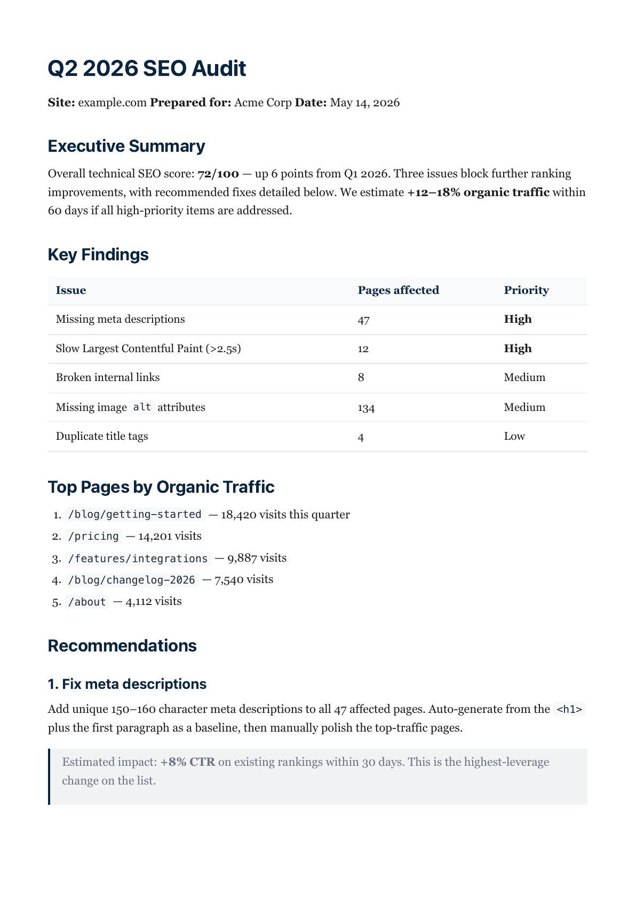
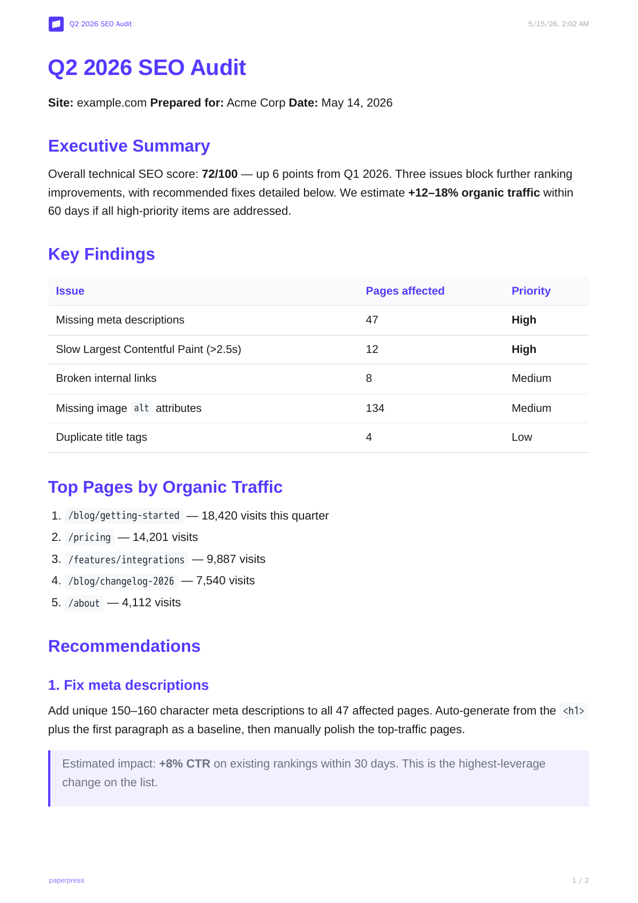

# paperpress

An API that detects a company's brand from its live URL - logo, primary color, font - and renders markdown into a PDF styled in that brand, in one HTTP call. Plain REST API plus a hosted MCP endpoint.

## Try it right now

No signup, no key - hits the live instance's demo route (rate-limited, 30/hour/IP):

```bash
curl -X POST https://paperpress.up.railway.app/v1/demo \
  -H "Content-Type: application/json" \
  -d '{"url":"https://stripe.com"}'
```

Returns the brand kit detected live from `stripe.com` (primary color, logo, real font stack) plus a signed URL to a PDF rendered in it, generated at the moment you ran that command. Swap in any company's URL.

With your own markdown and an API key, the same shortcut is `brandFromUrl`:

```
POST /v1/documents
{ "markdown": "# Q4 report\n...", "brandFromUrl": "stripe.com" }
→ ~1s → signed URL to a PDF in Stripe's brand
```

## What's actually different here

Two concrete things, out of everything else in this repo:

1. **The detector reads live browser state, not a database.** Brandfetch - the funded, customer-backed competitor doing brand data for AI agents - works off a curated, crawled database: it has to have seen a company before, and coverage/freshness is the product. This navigates the real page with Playwright and reads `getComputedStyle`, actual CSS custom properties, and rendered CTA colors at request time, on any URL, including ones nobody's indexed yet. It also returns the exact font stack (e.g. `"sohne-var, SF Pro Display"`), not a coarse `serif`/`sans`/`mono` bucket, because it's reading what the browser renders, not classifying against a lookup table.
2. **Detect + render is one atomic call.** Everywhere else, you glue two vendors together yourself: call a brand-data API, get JSON back, then separately call an HTML/PDF-render API with that JSON - two round trips, two bills, integration code in between. `brandFromUrl` does both inside one HTTP call, synchronously, in about a second.

Neither makes the underlying idea a good business on its own - see below - but they're the two decisions here that aren't just "another wrapper."

**Known, honest gap in the same detector**: it reads the DOM at `domcontentloaded`, so it works well on server-rendered marketing pages but misses brand signals on pages that render their real UI client-side after that (`open.spotify.com`, for example - it gets the logo, misses the color). Several fixes were tried and reverted rather than shipped half-working; see commit history if you want the detail. Documented as a limitation, not silently papered over.

## About this project

This was built and briefly run as a real deployed service before I looked closely at the market it would need to compete in: Claude ships native PDF/PPTX/DOCX generation now, and Brandfetch already sells a Brand Context API built specifically for grounding AI agents, with real paying customers. Both halves of what this does - detect a brand, render a document - are now commodity-adjacent or already owned by a funded competitor. I'm not pursuing this as a product.

It's public as a portfolio piece / reference implementation: a working Playwright-based brand detector (CSS custom properties, CTA color sampling, scored logo-candidate extraction, WCAG contrast guard), a sync Fastify render pipeline, an SSRF-hardened URL fetcher, and a hosted MCP endpoint. Read the code, fork it, run it - it's MIT licensed. It is not maintained as a product: no payment processing is wired up.

## How it works

A single Fastify process does three things:

1. **Detect** (`src/render/detect.ts`) - navigates the target URL with a pooled Playwright/Chromium instance, reads `theme-color`, brand CSS custom properties, CTA button colors, header `` candidates scored by position/size/format, and computed font stacks. Filters near-white/near-black/near-gray noise, applies a WCAG luminance guard so a too-light brand color doesn't blow out text contrast.
2. **Render** (`src/render/`) - turns markdown into HTML via `unified`/`remark`/`rehype` (with `allowDangerousHtml: false`), applies one of five themes plus the detected/supplied brand kit, and prints to PDF with Playwright.
3. **Serve** - PDFs go to local disk (or a mounted volume) behind HMAC-signed, time-limited URLs.

No queue, no worker process, no Redis. Renders are sync and typically 100–400ms once Chromium is warm; detection is cached 24h per host.

## What's here

```
.
├── src/                       Fastify API (single process)
│   ├── index.ts               Bootstrap, route registration
│   ├── env.ts                 Env validation (zod)
│   ├── lib/                   prisma, auth, billing, storage, email, url-fetch (SSRF guard), inline-image
│   ├── render/                markdown → HTML → PDF (themes/, detect.ts)
│   └── routes/                auth, documents, demo, account, pdf, brand-kits, admin, mcp
├── prisma/schema.prisma       5 models: User, ApiKey, Document, CreditTransaction, BrandKit
├── samples/                   Example output (see Examples below) + input markdown used to generate it
├── scripts/                   preview.ts / detect.ts - regenerate the samples/ output locally
├── Dockerfile                 Single-image deploy (Playwright base)
└── railway.json               Railway config (healthcheck only - start cmd is in Dockerfile)
```

## API surface (v1)

### Auth
| Method | Path | Auth | What it does |
|---|---|---|---|
| POST | `/auth/register` | - | Request a key by email. Always 202; key is sent to the inbox. First time = new user + free credits. Subsequent calls = rotate (old keys valid 24h, then revoked). |

### Render
| Method | Path | Auth | What it does |
|---|---|---|---|
| POST | `/v1/documents` | Bearer key | Markdown → PDF. Accepts `theme`, `brandKit` (saved name or inline), `brandFromUrl` (detect-and-apply shortcut), `css`, `format`, `landscape`, `title`. Returns signed URL. 413 if rendered pages > `MAX_PAGES_PER_RENDER` (default 200). |
| GET | `/pdf/:id?exp=&sig=` | signed URL | Stream the PDF |

### Brand kits
| Method | Path | Auth | What it does |
|---|---|---|---|
| POST | `/v1/brand-kits` | Bearer key | Create/update a saved kit by name (one per user per name) |
| GET | `/v1/brand-kits` | Bearer key | List your kits |
| GET | `/v1/brand-kits/:id` | Bearer key | Read one kit |
| DELETE | `/v1/brand-kits/:id` | Bearer key | Delete a kit |
| POST | `/v1/brand-kits/detect` | Bearer key | Pass a URL, get back `primaryColor`, `logoUrl`, `favicon`, `fontFamily`, `fontStyle`. 24h-cached. Pass `{ refresh: true }` to bypass. |
| POST | `/v1/brand-kits/detect-batch` | Bearer key | Up to 20 URLs in parallel through the existing Playwright pool. Per-item errors return inline. |

### Account / health
| Method | Path | Auth | What it does |
|---|---|---|---|
| GET | `/account` | Bearer key | Email, credits, list of active API keys (plaintext, so users can recover) |
| GET | `/health` | - | `{ status: 'ok' }` |

### Demo (anonymous, gated)
No auth, no credits charged. Strict per-IP rate limit (30/hour) on top of the global 60/min.

| Method | Path | What it does |
|---|---|---|
| POST | `/v1/demo` | `{ url }` → detect brand (cached) + render the bundled `samples/demo-q4-review.md` as PDF. Returns kit + signed URL. |

### Admin (read-only)
Gated by `X-Admin-Token` header. When `ADMIN_TOKEN` is unset, every `/admin/*` route returns 404 - no surface, no discovery.

| Method | Path | What it does |
|---|---|---|
| GET | `/admin/stats` | Totals: users, active keys, docs, pages, bytes, credits, doc counts for last 24h / 7d |
| GET | `/admin/users` | Paginated list with per-user doc and key counts |
| GET | `/admin/documents` | Paginated list with user email joined. Filter by `userId`, `status`. |
| GET | `/admin/documents/:id/pdf` | Stream any PDF without a signed URL |

### MCP
| Path | What it does |
|---|---|
| POST `/mcp` | Streamable HTTP MCP endpoint - one `generate_pdf` tool, same auth/credits as `/v1/documents`. Standard MCP transport, not tied to any one vendor's client or model: works with Claude Desktop, Claude.ai connectors, Cursor, Claude Code, and any other MCP-compatible client, local-model-based agents included, as long as it speaks Streamable HTTP. Verified directly against the raw `@modelcontextprotocol/sdk` client and Claude/Cursor-style configs; not tested against a specific local-model client, but nothing here is Claude-specific - the server has no idea what model is on the other end. No install, no npm package - see `src/routes/mcp.ts`. |

## Security posture

- **API keys**: 192-bit random, stored as plaintext (so `/account` can show them); revocation uses a `revokedAt` timestamp with a grace window.
- **Signed URLs**: HMAC-SHA256, `exp` + `sig` query params, 7-day default TTL.
- **SSRF guard**: `assertPublicUrl` resolves DNS and rejects RFC1918, loopback, link-local, IPv6 ULA on the URL a caller submits. Applied to `brandKit.logoUrl` and `/v1/brand-kits/detect`. The submitted host being public doesn't guarantee every hop is - a public host can redirect to a private address - so both the Playwright navigation path (`src/render/detect.ts`) and the image-inlining fetch (`src/lib/inline-image.ts`) re-validate the address on every redirect hop before following it and again after final navigation. This narrows the window but doesn't fully eliminate it: the initial connection to a redirect target happens before the re-check can reject it, so a determined attacker can still cause a blind outbound request (no response data is returned to them) even though no page content is ever extracted or rendered from a rejected target. Full closure would need IP-pinning at the network layer.
- **CSS injection guard**: the `css` field rejects `<style>`, `</style>`, `<script>`, `</script>` - otherwise the raw embed inside `<style>${css}</style>` would let an attacker break out and run JS in the Chromium pool.
- **Markdown sanitization**: `remark-rehype` runs with `allowDangerousHtml: false`, so `<script>` in markdown bodies is stripped.
- **Limits**: markdown ≤ 500KB, css ≤ 50KB, body ≤ 2MB, render ≤ 30s, rendered pages ≤ `MAX_PAGES_PER_RENDER` (default 200), rate ≤ 60 req/min/key.
- **Admin endpoint**: constant-time token compare; routes return 404 (not 401) when token wrong or unset.

## Known limitations

Not a product, so these are disclosed rather than tracked as a backlog:

- **No automated test suite.** Everything above was verified by hand against a running instance; there's no regression net.
- **No committed Prisma migrations.** The container start command runs `prisma db push --skip-generate --accept-data-loss`.
- **In-memory rate limiting and detect-cache.** Fine single-instance; wouldn't survive multiple replicas without moving both to something shared.
- **No payment processing wired up.** The credit system exists in the schema and API; nothing charges a card.
- **Detection can hang on client-hydrated pages.** `page.evaluate()` in `detect.ts` has no timeout in Playwright's API. With `PLAYWRIGHT_MAX_CONTEXTS` at its default of 2, two such requests exhaust render capacity for everyone until restart. See "What's actually different here" above.

## Local dev

```bash
# 1. Postgres running locally on 5432
# 2. Env
cp .env.example .env
# (set SIGNING_SECRET to `openssl rand -base64 32`)

# 3. Install + migrate
npm install
npx prisma migrate dev

# 4. Run
npm run dev
```

Smoke test:

```bash
# Request a key. Response is { "sent": true } - the key arrives by email.
# In dev (RESEND_API_KEY unset) the server logs the email to stdout; grab the
# key from there.
curl -X POST http://localhost:3000/auth/register \
  -H "Content-Type: application/json" \
  -d '{"email":"you@example.com"}'

export PP_KEY="pp_live_..."

# Render
curl -X POST http://localhost:3000/v1/documents \
  -H "Authorization: Bearer $PP_KEY" \
  -H "Content-Type: application/json" \
  -d '{"markdown":"# Hello\n\nWorld.","title":"Test"}'
```

## Deploy (Railway example)

The exact steps used for the real deployment this was run under - kept here as documentation, not as an invitation to run this in production.

```bash
# 1. Create project with a Postgres database
railway init --name paperpress
railway add --database postgres

# 2. Create the app service. DATABASE_URL is wired via service reference.
railway add --service paperpress \
  --variables "DATABASE_URL=\${{Postgres.DATABASE_URL}}" \
  --variables "SIGNING_SECRET=$(openssl rand -base64 32)" \
  --variables "PUBLIC_BASE_URL=https://your-app.up.railway.app" \
  --variables "STORAGE_DIR=/data/storage" \
  --variables "NODE_ENV=production" \
  --variables "FREE_TIER_CREDITS=100" \
  --variables "PLAYWRIGHT_MAX_CONTEXTS=2" \
  --variables "RENDER_TIMEOUT_MS=30000" \
  --variables "KEY_GRACE_PERIOD_HOURS=24" \
  --variables "MAX_PAGES_PER_RENDER=200" \
  --variables "ADMIN_TOKEN=$(openssl rand -base64 36 | tr -d '\n')"

# 3. Attach a volume so PDFs survive container restarts
railway service paperpress
railway volume add --mount-path /data/storage

# 4. Domain (auto-detects the container port)
railway domain --port 3000

# 5. Ship
railway up --detach -c
```

Notes:
- The Dockerfile uses `mcr.microsoft.com/playwright:vX.Y-jammy` as the base. Keep that version in lockstep with the `playwright` npm package - a mismatch means the browser binary won't exist and renders fail.
- The `startCommand` in `railway.json` is intentionally absent: Railway parses it as argv (not shell), so chained `&&` commands fail. The `CMD` in `Dockerfile` wraps in `sh -c` and runs the full start sequence.
- Emails: until `RESEND_API_KEY` is set, registration keys are logged to stdout. Grep for `[email:console]`.

## Examples

All of these are checked into [samples/](samples/) - generated by `scripts/preview.ts` and `scripts/detect.ts`, regenerate them yourself with `npx tsx scripts/preview.ts` / `npx tsx scripts/detect.ts <url>`.

**Same markdown, five themes** (`clean` shown below - [full PDF](samples/preview-clean.pdf)):



| Theme | PDF |
|---|---|
| `academic` | [preview-academic.pdf](samples/preview-academic.pdf) |
| `executive` | [preview-executive.pdf](samples/preview-executive.pdf) |
| `marketing` | [preview-marketing.pdf](samples/preview-marketing.pdf) |
| `technical` | [preview-technical.pdf](samples/preview-technical.pdf) |

**Brand auto-detected from a live URL** (`brandFromUrl: "stripe.com"` - [full PDF](samples/detect-stripe-com.pdf)):



| Source URL | Detected + rendered |
|---|---|
| github.com | [detect-github-com.pdf](samples/detect-github-com.pdf) |
| railway.com | [detect-railway-com.pdf](samples/detect-railway-com.pdf) |
| vercel.com | [detect-vercel-com.pdf](samples/detect-vercel-com.pdf) |

**Inline brand kits** (no URL, fields passed directly in the request) - [forest](samples/preview-kit-forest.pdf), [mono-coral](samples/preview-kit-mono-coral.pdf), [stripe-colors](samples/preview-kit-stripe.pdf).

**Input markdown** used above: [sample.md](samples/sample.md), [demo-q4-review.md](samples/demo-q4-review.md) (the one used by `/v1/demo`).

## Status

**Built**: markdown → PDF across 5 themes, brand-kit auto-detect from a URL (real font-family stack, not just a `serif|sans|mono` bucket), 24h detect cache, `brandFromUrl` one-call shortcut, batch detect (20 URLs in parallel), WCAG luminance guard, email-based key issuance with rotation grace, a hosted Streamable HTTP MCP endpoint, a read-only admin surface, signed share URLs.

**Not built, on purpose**: payment processing, automated tests, real Prisma migrations. This isn't a live backlog - it's finished as a portfolio piece, not being developed toward a 1.0.

## License

MIT - see [LICENSE](LICENSE).
